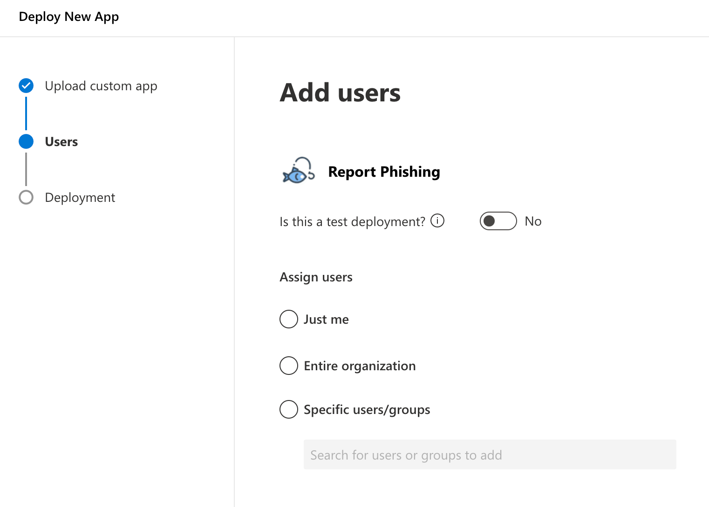

# Microsoft Report Phishing Button

A customized version of the Microsoft Report phishing button with a DALL-E generated fish and hook icon. To be deploy via M365 manifest.

Instead of the regular add-in URL, use this one to deploy the custom image Report Phishing Button: https://raw.githubusercontent.com/zarguell/ms-phishing/main/ReportPhishingAzure.xml

For more details, see [here](https://learn.microsoft.com/en-us/microsoft-365/security/office-365-security/submissions-users-report-message-add-in-configure?view=o365-worldwide#get-the-report-message-or-the-report-phishing-add-ins-for-your-microsoft-365-gcc-or-gcc-high-organization).

Currently includes assets of the following sizes:

| Name | Size | Original Url | New URL |
| ---- | ---- | ------------ | ------- |
| ReportMessage16.png | 16x16 px | https://ipagave.azurewebsites.net/Images/ReportMessage16.png | https://raw.githubusercontent.com/zarguell/ms-phishing/main/assets/ReportMessage16.png |
| ReportMessage32.png | 32x32 px | https://ipagave.azurewebsites.net/Images/ReportMessage32.png | https://raw.githubusercontent.com/zarguell/ms-phishing/main/assets/ReportMessage32.png |
| ReportPhish64.png | 64x64 px | https://ipagave.azurewebsites.net/Images/ReportPhish64.png | https://raw.githubusercontent.com/zarguell/ms-phishing/main/assets/ReportPhish64.png |
| ReportMessage80.png | 80x80 px | https://ipagave.azurewebsites.net/Images/ReportMessage80.png | https://raw.githubusercontent.com/zarguell/ms-phishing/main/assets/ReportMessage80.png |
| ReportPhish128.png | 128x128 px| https://ipagave.azurewebsites.net/Images/ReportPhish128.png | https://raw.githubusercontent.com/zarguell/ms-phishing/main/assets/ReportPhish128.png |

AddIn Preview:

